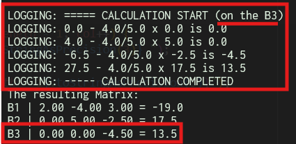

# Aljabar_Linier_Gauss
 

A simple tool to calculate/find the value of a variable from several equations using the Gauss method.  

## Requirements
- Dart: v3.4.4 or above.
> [!NOTE]
> or maybe you can try it in another version that supports dart null safety

## Instruction
### Run the program
To use the program, you just have to perform the command \
`dart run <file_name>.dart`  
in your terminal/console/cmd.

for example: \
`dart run gauss_gauss.dart`

### Logging (optional) *\*gauss_gauss and gauss_jordan only*
The program will output some log texts of the operations that have been performed.

    
Logging - Screenshoot

    

 

To enable logging you must supply arguments when running the.dart file such as, \
`dart run <file_name>.dart -log`

for example: \
`dart run gauss_jordan.dart -log`